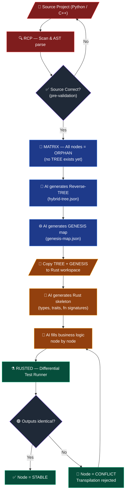

# 🦀 hybrid-RUSTED — RT-Engine (Reverse-Transpilation Engine)
> *v0.6.2 · 2026-03-05 · Copyright Fabrizio Baroni · Apache 2.0*
> **[github.com/barros73/hybrid-RUSTED](https://github.com/barros73/hybrid-RUSTED)**

A **deterministic transpilation orchestrator** that converts any legacy codebase (Python, C++) into Rust — using the Hybrid Ecosystem's structural intelligence to guarantee zero-regression through automated **Differential Testing**.

---

## 🗺️ Architecture: Two Workspaces, One Bridge

RUSTED operates across two Hybrid workspace folders simultaneously:

```
📁 /source-project/          📁 /rust-project/
├── hybrid-rcp.json    →→→   ├── hybrid-rcp.json  (Rust skeleton)
├── hybrid-tree.json   →→→   ├── hybrid-tree.json (copied as blueprint)
├── genesis-map.json   →→→   ├── genesis-map.json (copied as blueprint)
└── [original code]          └── [generated Rust code]
         ↕ RUSTED bridges both ↕
         differential test runner
```

| Workspace | Role |
|:--|:--|
| **Source** | Original Python / C++ codebase, fully mapped by Hybrid |
| **Rust** | New Rust project, skeleton generated from Source's TREE + GENESIS |

---

## ⚙️ Pipeline



### Step-by-Step

| # | Step | Owner |
|:--|:--|:--|
| 1 | **Pre-validate source**: run existing test suite; fix errors before proceeding | AI + User |
| 2 | **RCP scan** of source directory → `hybrid-rcp.json` | `hybrid-RCP` |
| 3 | **MATRIX orphan detection**: 100% of nodes flagged ORPHAN (no TREE yet) | `hybrid-MATRIX` |
| 4 | **Reverse-TREE generation**: AI deduces logical intent from orphan nodes → `hybrid-tree.json` | AI |
| 5 | **GENESIS map generation**: AI builds spatial relationship graph → `genesis-map.json` | AI |
| 6 | **Copy TREE + GENESIS** into Rust workspace as the architectural blueprint | RUSTED |
| 7 | **Rust skeleton generation**: empty `struct`s, `trait`s, `fn` signatures — no logic yet | AI |
| 8 | **Logic filling**: AI implements business logic, node by node, inside safe skeleton bounds | AI |
| 9 | **Differential testing**: RUSTED executes both binaries with identical inputs, asserts outputs | `hybrid-RUSTED` |

---

## ⚗️ Differential Testing Engine

RUSTED is responsible for **behavioral equivalence verification** between the original and the Rust binary using a **statistical multi-run protocol** — a single test is never sufficient.

```
N runs per node (identical seed per run):
  Source binary ──┐
                  ├──► input[i] ──► output_source[i]
  Rust binary   ──┘               output_rust[i]

Statistics:
  diff[i]    = |output_rust[i] - output_source[i]|
  mean_diff  = avg(diff[0..N])
  std_diff   = stddev(diff[0..N])
  max_diff   = max(diff[0..N])

Gate:
  mean_diff ≤ ε_mean  AND  max_diff ≤ ε_max  →  🟢 STABLE
  otherwise                                   →  🔴 CONFLICT
```

### Why multi-run?

| Metric | What it catches |
|:--|:--|
| `mean_diff` | Systematic drift between languages (e.g. math library differences) |
| `std_diff` | Inconsistent behavior — source is non-deterministic or has race conditions |
| `max_diff` | Outlier spikes hidden by a good average |

> **Bonus diagnostic:** If `stddev(output_source) > 0` across runs with identical seeds, the **source code itself is non-deterministic** — a bug to fix *before* transpilation begins.

### Epsilon configuration

`ε_mean` and `ε_max` are **configurable per node type** in `rusted.config.json`. Integer logic nodes use `ε = 0` (exact match). Floating-point computation nodes use a relaxed epsilon calibrated to the domain's required precision.

### Other guarantees

- **Parallel execution**: Both processes run concurrently; RUSTED manages lifecycle, I/O capture, and comparison.
- **Partial conversion support**: RUSTED handles hybrid states where some nodes are already in Rust while others remain in the original language, tracking progress continuously across both workspaces.
- **Source pre-validation**: Before any transpilation, RUSTED verifies the source test suite passes with `std_diff = 0` baseline. A failing or unstable source is rejected immediately.

---

## ⚠️ Architectural Translation Rules

Direct 1:1 translation is **forbidden**. The AI must adapt to idiomatic Rust:

### C++ → Rust
| C++ Pattern | Rust Translation |
|:--|:--|
| Class hierarchy + multiple inheritance | Flatten to `struct`s + `trait`s |
| Virtual methods / polymorphism | `dyn Trait` or static dispatch |
| Manual memory (`new`/`delete`) | Ownership model — no `unsafe` unless justified |
| Namespaces | Rust modules (`mod`) |

### Python → Rust
| Python Pattern | Rust Translation |
|:--|:--|
| Dynamic typing | RCP infers types from hints + usage → static signatures |
| Garbage collection | Explicit ownership + lifetimes |
| `None` / optional returns | `Option<T>` |
| Exceptions | `Result<T, E>` |
| Mutable global state | `Arc<Mutex<T>>` or restructured ownership |

---

## 📊 MATRIX Integration

RUSTED writes back to MATRIX, keeping traceability live across both workspaces:

| Status | Meaning |
|:--|:--|
| 🟡 **ORPHAN** | Source node not yet transpiled |
| ⚪ **IN-PROGRESS** | Rust skeleton exists, logic being filled |
| 🔴 **CONFLICT** | Differential test failed — outputs diverged |
| 🟢 **STABLE** | Rust node passes all differential tests |

---

## 📦 Install

```bash
git clone https://github.com/barros73/hybrid-RUSTED
cd hybrid-RUSTED
bash install.sh     # compiles TypeScript + links hybrid-rusted globally
```

---

## 🖥️ CLI Reference

### `hybrid-rusted init`
Scans the source project, generates the Reverse-TREE AI prompt, copies TREE + GENESIS to the Rust workspace, and scaffolds the Rust skeleton.

```bash
hybrid-rusted init --source <source-dir> --rust <rust-dir>

# Example
hybrid-rusted init --source ./my-python-project --rust ./my-rust-project
```

| Flag | Required | Description |
|:--|:--|:--|
| `--source <dir>` | ✅ | Path to source project (Python / C++) |
| `--rust <dir>` | ✅ | Path to target Rust project |

---

### `hybrid-rusted test`
Runs the statistical differential test engine across all converted nodes (or a single node).

```bash
hybrid-rusted test                  # test all converted nodes
hybrid-rusted test --node <id>      # test a single node
hybrid-rusted test --runs 20        # override N from rusted.config.json
```

| Flag | Default | Description |
|:--|:--|:--|
| `--node <id>` | all nodes | Target a specific node ID |
| `--runs <n>` | from config | Override number of test runs |

**Output per node:**
```
🟢 STABLE   (mean=1.23e-10, max=4.50e-9)
🔴 CONFLICT (mean=3.11e-4,  max=1.20e-2)
```

---

### `hybrid-rusted status`
Prints the full conversion progress table from `rusted-state.json`.

```bash
hybrid-rusted status
```

```
🦀 hybrid-RUSTED — Conversion Status
   Source : ./my-python-project
   Rust   : ./my-rust-project

   Node ID                                 Status      mean_diff     max_diff
   ────────────────────────────────────────────────────────────────────────────
   optimizer::bayesian_step                🟢 STABLE   1.20e-11      3.40e-9
   optimizer::tpe_sampler                  🔴 CONFLICT 4.50e-4       1.20e-2
   optimizer::trial_suggest                ⚪ PENDING  —             —

   Summary: 🟢 1 STABLE  🔴 1 CONFLICT  🔄 0 IN_PROGRESS  ⚪ 1 PENDING
```

---

### `rusted.config.json`
```json
{
  "runs": 10,
  "epsilon": {
    "default": { "mean": 1e-9, "max": 1e-6 },
    "integer": { "mean": 0,    "max": 0    },
    "float":   { "mean": 1e-7, "max": 1e-4 }
  },
  "sourceWorkspace": "./my-python-project",
  "rustWorkspace":   "./my-rust-project",
  "timeout_ms": 30000
}
```

---

*Copyright 2026 Fabrizio Baroni. Licensed under the Apache License, Version 2.0.*
